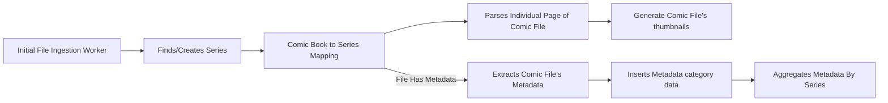

# Worker Pipeline for ingestion

## Worker Flow Overview

```mermaid
flowchart LR
    Worker1[Initial File Ingestion Worker] --> Worker2[Finds/Creates Series]
    Worker2 --> Worker3[Comic Book to Series Mapping]
    Worker3 --> Worker4[Parses Individual Page of Comic File]
    Worker4 --> Worker5[Generate Comic File's thumbnails]
    Worker3 --> |File Has Metadata| Worker6[Extracts Comic File's Metadata]
    Worker6 --> Worker7[Inserts Metadata category data]
    Worker7 --> Worker8[Aggregates Metadata By Series]

```

### Workers

