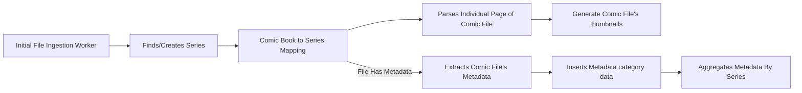

# Worker Pipeline for ingestion

## Worker Flow Overview

### Workers

## Ingestion Workers

The First Set of workers that process the file initially

### IngestionWorker

- Pulls the Next job from the INGESTION_DISCOVERY queue as a IngestionPayload object
- Checks if the file still exists and has not been deleted/moved since the file was initially found
- Determines what library the file belongs to
- Create a Payload of type IngestionToComicBookRecordPayload and adds it to the BOOK_RECORD Queue

### ComicBookRecordWorker

- Pulls the next job from the BOOK_RECORD queue as a IngestionToComicBookRecordPayload
- Parse surface level detail from the comic file such series name, issue
- Checks if the file has some form of metadata
- Create a NewComicBook object with the parsed info
- Inserts the NewComicBook object into the ComicBook table (keeps track of the new db row's id)
- Create the next payload as a IngestionToComicSeriesMappingPayload type
- Add the payload to the BOOK_SERIES_MAPPING queue

### ComicBookSeriesMappingWorker

- Pulls the next job from the BOOK_SERIES_MAPPING queue as a IngestionToComicSeriesMappingPayload object
- Checks if there is a comic series entry corresponding to the payload file's parent directory
- If there is not a record in the comic series db table then we create one
- Check the previous payload's metadata flag if there is metadata for this file and if so create a new payload
- Add this metadata payload to the "" queue 
- Create a new payload for the comic pages worker, add it to the "" queue

## Pages Workers

The second part of the main comic file logic, these workers by default after the the first part of the comic file logic

### ComicPagesWorker

- Pulls the next job from the "" queue as an object
- Checks the manifest for metadata page info
- Extracts these images temporarily into a temp directory
- For each file determine the hash of each file + page type
- Determine what is the first page of the archive + any files labeled as a cover and compile these pages
- Create a new payload with the cover page info and add it to the "" queue

### ComicThumbnailsWorker

- Pulls the next job from the "" queue as an object
- Checks the payload for the files identified as covers
- Extract those images into a temp directory
- For each image create a thumbnail for it and save it to the thumbnail directory
- Record the thumbnail into the "" db table
- Map the comic book record to the thumbnail record

## Metadata Workers

An optional pipeline where if a comic file is found to have a metadata file as part of its archive contents then additional steps are taken to take advantage of this data and ingest it

### MetadataWorker

- Uses the external npm library to extract the metadata from the comic book file
- Standardized/normalizes the data
- If the standardization/normalization succeeds then a new payload is created with this metadata as part of it
- Adds it to the "" queue

### MetadataInsertionWorker

- Pulls the job data from the queue as a object
- Checks what values are available in the metadata format
- For each valid key-value pair run the appropriate insertion action against the db
- Creates the next payload with an object listing the metadata categories that were inserted

### MetadataAggregationWorker

- Pulls the job data from the queue ad an object
- Reads the manifest of what values were inserted for new comic books
- For each category we pull all the comic books belonging the same series and re aggregating these values
- Updating or inserting a new record for this
